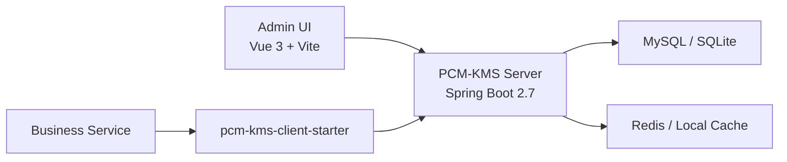

# PCM-KMS

A clean, lightweight Key Management System built with Spring Boot 2.7, Spring Cloud 2021, Vue 3, MySQL/SQLite, and optional Redis.

## Goals

PCM-KMS is intentionally optimized for these three goals first:

- A KMS that can run locally with minimal setup
- A KMS that business services can integrate with easily
- A KMS that still feels maintainable six months later

This means:

- single-service first, not microservices-first
- standard open source stack, not internal platform dependencies
- explicit boundaries, not framework-heavy coupling
- Redis optional, SQLite supported, local run is a first-class path

## Why This Project Exists

The previous KMS implementation already covered many useful capabilities, but it also became heavier over time:

- too coupled to internal frameworks and infrastructure
- too many deployment assumptions
- too much framework-driven complexity for a personal long-term project

PCM-KMS is the rewrite direction: keep the valuable KMS product ideas, remove the unnecessary engineering weight.

## Scope

### What v1 should do well

- key lifecycle management
- alias-based crypto access
- client registration and authorization
- automatic request signing and verification
- audit logging
- lightweight management UI
- starter-based service integration

### What v1 should not overdo

- mandatory service registry
- mandatory gateway
- heavy distributed deployment model
- hardware security module support
- complex platform dependencies

## Architecture At A Glance



Design position:

- local-first
- single deployment first
- extensible later
- secure by default

## Planned Repository Layout

```text
pcm-kms/
├── docs/
├── sql/
├── pcm-kms-common/
├── pcm-kms-domain/
├── pcm-kms-core/
├── pcm-kms-infra/
├── pcm-kms-server/
├── pcm-kms-client-starter/
└── pcm-kms-admin-ui/
```

## Tech Stack

### Backend

- Spring Boot 2.7.x
- Spring Cloud 2021.0.x
- MyBatis-Plus 3.5.x
- Flyway
- Sa-Token
- BouncyCastle
- Caffeine
- Redis optional
- MySQL / SQLite

### Frontend

- Vue 3
- Vite
- Pinia
- Vue Router
- Element Plus
- Axios

## Run Modes

### Minimal local mode

Recommended for first run and daily development:

- SQLite
- local cache
- single backend process
- no Redis required

### Standard dev mode

Recommended for team debugging:

- MySQL
- Redis
- strict signing enabled

## Documentation

| File | Purpose |
| --- | --- |
| [docs/01-总体设计方案.md](D:/pcm/MyProject/pcm-kms/docs/01-%E6%80%BB%E4%BD%93%E8%AE%BE%E8%AE%A1%E6%96%B9%E6%A1%88.md) | overall architecture, domain boundaries, security model |
| [docs/02-开发进度周期说明.md](D:/pcm/MyProject/pcm-kms/docs/02-%E5%BC%80%E5%8F%91%E8%BF%9B%E5%BA%A6%E5%91%A8%E6%9C%9F%E8%AF%B4%E6%98%8E.md) | phased roadmap and milestones |
| [docs/03-快速接入文档.md](D:/pcm/MyProject/pcm-kms/docs/03-%E5%BF%AB%E9%80%9F%E6%8E%A5%E5%85%A5%E6%96%87%E6%A1%A3.md) | fast onboarding and integration guide |
| [docs/04-框架说明与启动指南.md](D:/pcm/MyProject/pcm-kms/docs/04-%E6%A1%86%E6%9E%B6%E8%AF%B4%E6%98%8E%E4%B8%8E%E5%90%AF%E5%8A%A8%E6%8C%87%E5%8D%97.md) | framework choices and startup guidance |
| [docs/05-多智能体协作开发说明.md](D:/pcm/MyProject/pcm-kms/docs/05-%E5%A4%9A%E6%99%BA%E8%83%BD%E4%BD%93%E5%8D%8F%E4%BD%9C%E5%BC%80%E5%8F%91%E8%AF%B4%E6%98%8E.md) | multi-agent collaboration, handoff, work log rules |
| [docs/06-协作记录模板.md](D:/pcm/MyProject/pcm-kms/docs/06-%E5%8D%8F%E4%BD%9C%E8%AE%B0%E5%BD%95%E6%A8%A1%E6%9D%BF.md) | handoff log template for parallel contributors |

## Principles

- Use aliases as the main business-facing key identifier
- Generate key material when an application is enabled, not only when it is created
- Keep private keys and symmetric key material non-readable from ordinary interfaces
- Prefer automatic signing and verification in the starter
- Prefer explicit API access first, annotation-based enhancement second
- Keep logs auditable without leaking plaintext

## Roadmap

### Phase 1

- bootstrappable backend
- bootstrappable frontend
- MySQL / SQLite switching
- Redis / local cache switching

### Phase 2

- key lifecycle
- crypto APIs
- client auth
- audit logging

### Phase 3

- starter integration
- management UI
- smoother onboarding

### Phase 4

- rate limits
- replay protection
- metrics
- Docker

## Current Note

This repository currently focuses on design and planning documents first.  
The next implementation step should follow the phased plan rather than trying to build everything at once.

## License

MIT
