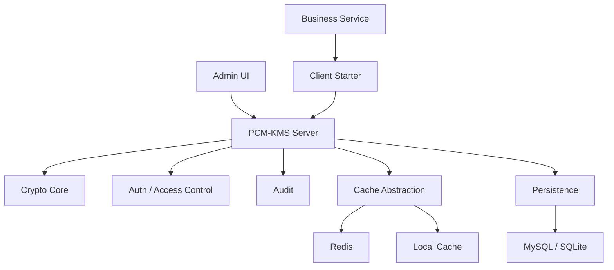
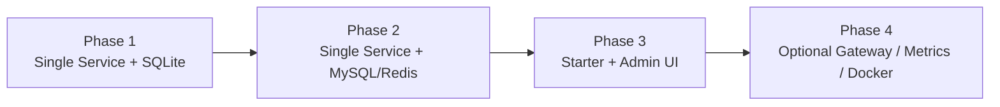
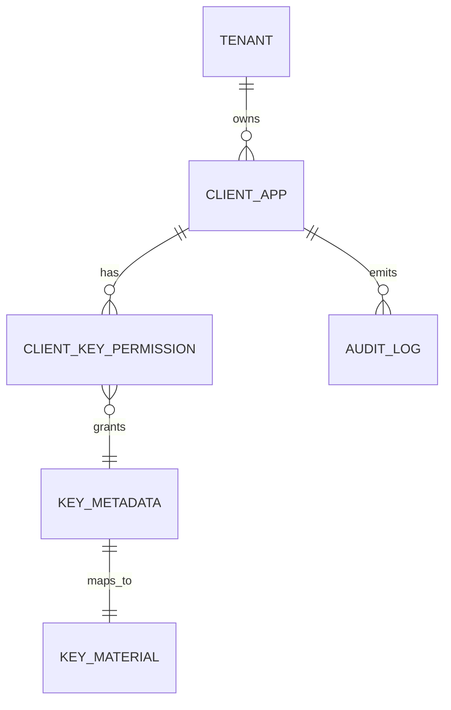

# PCM-KMS 总体设计方案

版本：v1.1  
日期：2026-06-10

## 1. 设计目标

PCM-KMS 的第一优先级不是做成“看起来很完整的大平台”，而是先把下面三件事做扎实：

- 一个能本地直接跑起来的 KMS
- 一个能被业务服务轻松接入的 KMS
- 一个你半年后再看也不会觉得太重的 KMS

围绕这三个目标，本方案采用这些基本原则：

- 单体优先，扩展预留
- 本地优先，部署简单
- 标准组件优先，避免内部依赖
- 安全默认开启，但本地体验不折腾
- 显式 API 优先，注解增强其次

## 2. 输入来源

本方案综合了三类输入：

- 旧代码：`D:\pcm\project\kms`
- 旧设计文档：`docs/old/`
- 当前仓库已有设计草稿与 DeepSeek 文档补充

保留的有效产品思路：

- 应用创建后先不直接发放完整接入材料
- 应用启用后再生成接入所需的密钥材料和标识
- 业务系统通过 `alias` 使用密钥，而不是直接依赖 `secret_id`
- 自动签名、自动验签、自动审计是重要体验点
- Starter 同时支持编程式和注解式接入思路

## 3. 总体定位

PCM-KMS 目标是一个纯净、可开源、可长期维护的 KMS 工程模板。

它应具备：

- 管理端：创建应用、创建密钥、分配权限、查看审计
- 服务端：提供加解密、签名、验签、公钥查询等接口
- 接入端：通过 Starter 或 HTTP 方便业务系统使用

它不应在第一阶段承担：

- 强依赖网关
- 强依赖注册中心
- 强依赖配置中心
- 强依赖 Redis
- 强依赖 MySQL

## 4. 总体架构

### 4.1 逻辑架构



### 4.2 部署演进路线



说明：

- 第一阶段默认只有一个核心服务
- Spring Cloud 只保留扩展位，不强制先上全家桶
- Gateway、Nacos、OpenFeign 都属于后续增强项

## 5. 技术选型

### 5.1 后端

| 类别 | 方案 | 版本建议 | 说明 |
| --- | --- | --- | --- |
| 基础框架 | Spring Boot | 2.7.x | 稳定、成熟、兼容广 |
| Cloud 扩展 | Spring Cloud | 2021.0.x | 只保留扩展位 |
| ORM | MyBatis-Plus | 3.5.x | 开发效率高，便于管理系统 |
| 数据迁移 | Flyway | 9.x | 管理 MySQL / SQLite 脚本 |
| 鉴权 | Sa-Token | 1.37+ | 管理台轻量 RBAC |
| 加密库 | BouncyCastle | 1.7x+ | 支持 SM2/SM3/SM4 |
| 缓存 | Redis / Caffeine | 7.x / 3.x | Redis 可选，本地可降级 |
| JSON | Jackson | Boot 默认 | 标准可靠 |
| 文档 | Knife4j | 4.x | 联调和新人接入方便 |

### 5.2 前端

| 类别 | 方案 | 版本建议 | 说明 |
| --- | --- | --- | --- |
| 框架 | Vue 3 | 3.x | 简单主流 |
| 构建 | Vite | 5.x | 启动快 |
| 状态 | Pinia | 2.x | 轻量清晰 |
| 路由 | Vue Router | 4.x | 标准方案 |
| UI | Element Plus | 2.x | 管理后台成本最低 |
| HTTP | Axios | 1.x | 通用简单 |

## 6. 模块划分

建议仓库按以下方式组织：

```text
pcm-kms/
├── pcm-kms-common
├── pcm-kms-domain
├── pcm-kms-core
├── pcm-kms-infra
├── pcm-kms-server
├── pcm-kms-client-starter
├── pcm-kms-admin-ui
└── sql
```

### 6.1 模块职责

- `pcm-kms-common`
  - 统一响应
  - 异常
  - 常量
  - 公共工具

- `pcm-kms-domain`
  - 领域模型
  - 枚举
  - 领域服务接口

- `pcm-kms-core`
  - 算法引擎
  - 密钥生成
  - 签名验签
  - 轮转逻辑

- `pcm-kms-infra`
  - MyBatis-Plus
  - Flyway
  - 缓存实现
  - 审计实现

- `pcm-kms-server`
  - Controller
  - 应用服务
  - 配置装配
  - 启动入口

- `pcm-kms-client-starter`
  - `KmsClient`
  - 自动签名
  - 注解增强
  - 可选字段加解密扩展

- `pcm-kms-admin-ui`
  - 管理后台

## 7. 核心领域模型

### 7.1 关键实体

| 实体 | 作用 |
| --- | --- |
| `Tenant` | 顶层业务隔离边界 |
| `ClientApp` | 接入 KMS 的业务系统 |
| `KeyMetadata` | 密钥业务元数据 |
| `KeyMaterial` | 公钥、私钥、对称密钥材料 |
| `ClientKeyPermission` | 应用与密钥的授权关系 |
| `AuditLog` | 操作与调用审计 |
| `RateLimitRule` | 限流策略 |

### 7.2 关键关系



### 7.3 重要设计约束

- `alias` 是业务接入的主标识
- `secret_id` 是内部标识，不建议业务方直接依赖
- `alias + key_version` 在逻辑作用域内必须唯一
- 应用启用后再生成默认接入密钥材料
- 私钥和对称密钥只能加密存储

## 8. 功能设计

### 8.1 应用入驻

应用入驻建议分两步：

1. 创建应用
2. 启用应用

启用后自动生成：

- `client_id`
- `client_secret`
- `secret_id`
- 公钥
- 私钥
- 对称密钥
- 默认别名
- 初始版本

这个流程沿用旧设计中最有效的部分，因为它把“应用登记”和“实际接入生效”分开了。

### 8.2 密钥管理

支持：

- 创建密钥
- 查询密钥
- 启用 / 禁用
- 密钥轮转
- 历史版本查询
- 归档

建议使用双版本兼容策略：

- 新版本用于加密
- 老版本在过渡期内保留解密能力

### 8.3 加解密服务

第一阶段支持：

- AES
- SM4
- RSA
- SM2
- SHA-256
- SM3
- 签名 / 验签

默认规则：

- 业务通过别名访问密钥
- 未显式指定算法时，对称加密默认 AES
- 公钥查询通过别名返回最新可用版本公钥

### 8.4 鉴权与签名

请求链路建议：

1. 业务方提交 `clientId`
2. 携带 `timestamp`
3. 携带 `nonce`
4. 携带 `signature`
5. 服务端验签
6. 服务端做别名权限判断
7. 服务端记录审计

推荐默认签名算法：

- `HmacSHA256`

设计目标：

- 业务端尽量不手工拼签名
- Starter 自动封装签名和公共请求头

### 8.5 限流与防重放

建议至少支持：

- 分钟级限流
- 日级限流
- nonce 防重放

实现策略：

- Redis 优先
- 无 Redis 时降级到本地缓存

### 8.6 审计

审计拆成两类：

- 管理审计
- 调用审计

要求：

- 记录谁、何时、对哪个资源做了什么
- 不直接记录敏感明文
- 定期清理或归档日志

## 9. 安全设计

### 9.1 存储安全

- 私钥和对称密钥必须二次加密后落库
- 主密钥从环境变量读取
- 主密钥不写死在代码、配置模板或示例里

推荐环境变量：

- `PCM_KMS_MASTER_KEY`

### 9.2 接口安全

- OpenAPI 默认验签
- 管理后台默认登录后访问
- 普通查询接口不返回密钥原文
- 导出私钥必须额外授权和审计

### 9.3 日志安全

- 不打印明文
- 不打印完整密文
- 不打印完整 `client_secret`
- 失败日志保留诊断信息，但避免泄露密钥材料

## 10. 数据库策略

### 10.1 支持 MySQL 和 SQLite

规则：

- MySQL 用于常规开发、测试、生产
- SQLite 用于本地快速启动和轻量部署

### 10.2 兼容原则

- 不依赖存储过程
- 不依赖复杂触发器
- 尽量避免数据库方言特性
- 时间字段尽量由应用层控制

## 11. 版本路线

### v0.1

- 项目骨架
- 单体启动
- SQLite 本地跑通

### v0.2

- 密钥管理
- 加解密接口
- 应用启用生成接入材料

### v0.3

- Starter 接入
- 管理后台核心页面
- 审计与权限基础能力

### v0.4

- 限流
- 防重放
- 指标
- Docker

### v1.0

- 文档完善
- 接入体验稳定
- 测试补齐

## 12. 结论

PCM-KMS 的重点不是一开始做成复杂的“安全平台”，而是先把下面三点稳定交付：

- 本地能直接跑
- 业务能快速接入
- 工程长期不臃肿

后续所有增强能力，都应服从这三个目标，而不是反过来让项目重新变重。
