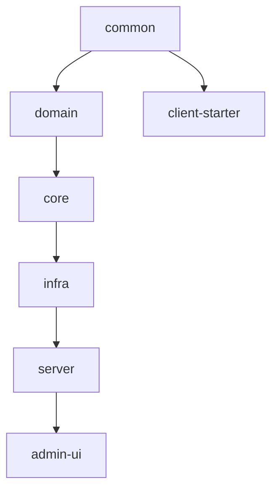

# PCM-KMS 框架说明与启动指南

版本：v1.1  
日期：2026-06-10

## 1. 文档目的

这份文档回答四个问题：

- 项目用了哪些框架
- 为什么这么选
- 如何快速启动
- 如何理解模块关系

## 2. 框架选择原则

PCM-KMS 不是为了追求“组件更多”，而是为了满足这三个目标：

- 本地可跑
- 接入轻量
- 长期不臃肿

因此框架选择遵循：

- 主流
- 简单
- 稳定
- 可替换

## 3. 后端说明

### Spring Boot 2.7.x

用途：

- 启动应用
- 自动配置
- REST API
- 标准配置管理

选择原因：

- 生态成熟
- 与 MyBatis-Plus、Sa-Token、Knife4j 兼容良好

### Spring Cloud 2021.0.x

用途：

- 为后续扩展保留位置

使用原则：

- 第一阶段不强依赖注册中心
- 第一阶段不强依赖配置中心
- 第一阶段不强依赖网关

### MyBatis-Plus

用途：

- 简化 CRUD
- 分页和查询封装

选择原因：

- 管理系统开发效率高
- 比复杂 ORM 映射更直观

### Flyway

用途：

- 管理 MySQL / SQLite 初始化和升级脚本

### Sa-Token

用途：

- 管理后台登录
- 角色权限控制

选择原因：

- 比 Spring Security 更轻
- 更适合当前项目规模

### Redis + Caffeine

用途：

- 元数据缓存
- nonce 防重放
- 限流计数

策略：

- Redis 可用时优先 Redis
- 不可用时自动降级到本地缓存

### BouncyCastle

用途：

- SM2
- SM3
- SM4

## 4. 前端说明

### Vue 3

用于管理后台主框架。

### Vite

用于本地开发和快速构建。

### Pinia

用于登录态和简单全局状态管理。

### Element Plus

用于表格、表单、弹窗和菜单。

## 5. Starter 设计原则

从旧设计里继承的核心思路之一，就是 Starter 应该真正降低接入成本。

建议保留这些原则：

- 默认编程式调用最稳定
- 注解式能力作为增强，不强制
- 自动签名
- 自动公共请求头封装
- 支持字段级别加解密扩展
- 支持集合、Map、嵌套字段路径扩展

不建议 Starter 承担：

- 深度侵入业务 ORM
- 强制绑定业务返回结构
- 强制接管业务工程的核心配置方式

## 6. 模块关系



## 7. 快速启动建议

### 最小模式

适合：

- 本地开发
- 新人体验
- 设计验证

推荐配置：

- SQLite
- 本地缓存
- 单体后端
- 关闭严格验签

### 标准模式

适合：

- 联调
- 多人开发

推荐配置：

- MySQL
- Redis
- 严格验签

## 8. 推荐配置项

### 服务配置

```properties
server.port=8080
spring.application.name=pcm-kms-server
```

### 数据源配置

```properties
kms.datasource.mode=mysql
spring.datasource.url=jdbc:mysql://127.0.0.1:3306/pcm_kms?useUnicode=true&characterEncoding=utf8&serverTimezone=Asia/Shanghai
spring.datasource.username=root
spring.datasource.password=123456
```

SQLite 示例：

```properties
kms.datasource.mode=sqlite
spring.datasource.url=jdbc:sqlite:./data/pcm-kms.db
spring.datasource.driver-class-name=org.sqlite.JDBC
```

### 缓存配置

```properties
kms.cache.type=auto
```

可选值：

- `auto`
- `redis`
- `local`

### 安全配置

```properties
kms.security.strict-sign=true
kms.security.request-expire-seconds=300
kms.security.enable-nonce-check=true
kms.security.enable-access-control=true
```

### 主密钥配置

建议使用环境变量：

```bash
PCM_KMS_MASTER_KEY=replace-with-your-own-master-key
```

## 9. 为什么这套方案更适合长期维护

因为它明确避免了这些常见负担：

- 内部 Parent POM 依赖
- 内部配置中心依赖
- Dubbo 强绑定
- 企业内网专属基础设施依赖
- 复杂但暂时用不上的分布式拆分

同时又保留了真正有用的 KMS 思路：

- 别名驱动访问
- 启用后生成接入材料
- 自动签名和自动验签
- 审计与轮转
- Starter 降低接入成本

## 10. 仓库文风建议

建议仓库长期保持以下结构：

- `README.md`
- `docs/`
- `sql/`
- `docker/`
- `examples/`

README 应优先回答：

- 项目是什么
- 为什么做
- 如何启动
- 如何接入
- 目前做到哪一步

而不是先堆太多实现细节。
